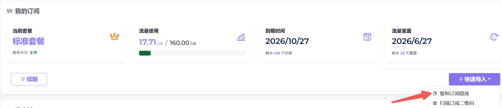

# 科学上网2026
介绍步骤流程，使用VPN代理，用于方便查阅学习资料

## 选择VPN平台
* 推荐使用：[狗狗加速注册链接](https://go.dginv.click/#/register?code=4sPLNMpY)
* 个人常年使用此平台，非常稳定
* 另外此平台可以使用GitHub上知名的开源客户端，更安全

## 登录购买
* 第一次登陆会赠送流量，可免费使用（活动可能变动）
* 标准套餐是**160G/月**，当前每月为16.9元（价格可能变动）
* 半年包和全年包有打折

## 下载客户端
下列Windows和安装均为GitHub知名的开源软件的官方下载页面。苹果系统为AppStore上架的平台App。下载后根据不同系统分别安装。
- Windows系统（下载64位版本）：https://github.com/clash-verge-rev/clash-verge-rev/releases/
- 安卓系统（下载arm64-v8a版本）：https://github.com/MetaCubeX/ClashMetaForAndroid/releases
- 苹果系统（AppStore下载doggygo-vpn）：https://apps.apple.com/us/app/doggygo-vpn-fast-secure/id6740422319

## 配置连接
* 回到平台网页，获取配置链接。如下图：

     

* 打开已安装好的客户端，找到【订阅配置】，填入上述链接即可。不同客户端操作各异，不一一赘述了，总之很简单。

## 开始学习
* 订阅配置完成后，找到客户端里的【代理】开关按钮，开启即可冲浪。
* 打开网站测试：https://www.youtube.com/

